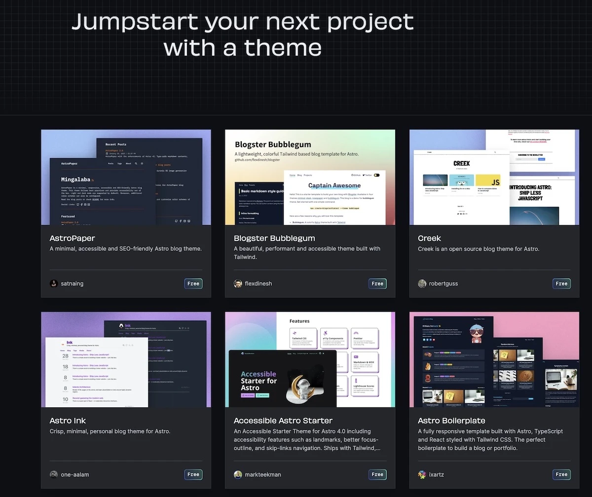
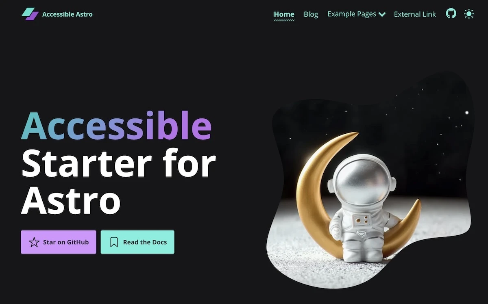
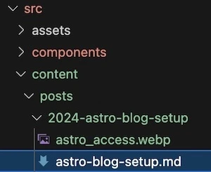

# Setup of my Astro blog

Published on: 2022-07-01

Welcome to my _new blog_ and my first blog post.
And as a first post, what could be a better topic than how I actually set up the Blog with the Astro platform.

## Preconditions

- Texteditor - I use Visual Studio Code
- Git
- Node.js

## Choosing Theme

Head on over to [Astro themes](https://astro.build/themes/), there are a ton of different good looking themes.



On this blog, I ended up using [Accessible Start for Astro](https://github.com/markteekman/accessible-astro-starter) created by [Mark Teekman](https://github.com/markteekman).
The main reasons for me choosing this theme was.

- I think it's really good-looking
- It uses tailwindcss for styling
- That it's accessible I think should be a plus when ranking at Google.
- It has over 500 stars on Github and issues seems to get solved fast.

I think the most important thing if you choose another theme is to make sure it has a good amount of stars, you can see that as a quality mark.

Even if you choose another theme there should be a lot of similarities regarding the setup.

## Let's get started

Open up your terminal and clone the team you selected.

### Step 1 Clone the repository

First, clone the repository to your local machine. Open your terminal (Command Prompt, PowerShell, or any terminal in macOS/Linux), navigate to the directory where you want to clone the repository and run:

```
git clone https://github.com/markteekman/accessible-astro-starter.git
```

Now you have the code, but before making any changes you want to rename the project to your name and push it to your repository.

### Step 2: Rename and initialize

After cloning you should rename the project, disconnect it from its original repository and, initialize a new repository.
Replace _MyAstrProject_ with something suitable.

```
mv accessible-astro-starter MyAstroProject
cd MyAstroProject
rm -rf .git
git init
git add .
git commit -m "first commit"
git branch -M main
```

### Step 3: Create a new repository on GitHub

Go to GitHub and create a new repository with your desired project name. Do not initialize it with a README, .gitignore, or license since your project already contains these files.

### Step 4: Link your local repository to GitHub

After creating the new repository on GitHub, you'll be given a URL for that repository. Use this URL to link your local repository to GitHub with the following command, replacing YOUR_GITHUB_USERNAME and YOUR_REPOSITORY_NAME with your actual GitHub username and the name of your new repository:

```
git remote add origin https://github.com/YOUR_GITHUB_USERNAME/YOUR_REPOSITORY_NAME.git
git push -u origin master
```

### Step 5 Install dependencies and run

You're almost there, having a blog up and running on your local machine.

```
npm install
npm run dev
```

That's it, open up your browser and visit [http://localhost:4321/](http://localhost:4321/) 🚀



Looking Great ⭐️

## Modifications I have done

### Minor modifications

- Changed the name of the site by updating the following files
  - Footer.astro
  - Navigation.astro
  - DefaultLayout.astro
  - SiteMeta.astro
- Updated the hero section (Generated a new image with the help of ChatGpt with inspiration from the original image, pretty cool 🤖)
  - Hero.astro
- Removed the menu items I didn't want.
  - Navigation.astro

### Blog post structure

When writing my blog posts I will mainly do it in markdown and maybe in some cases mdx files. I want my blog posts to be neatly organized, so I use [Content collections](https://docs.astro.build/en/guides/content-collections/) and I group each post with its images in a separate folder.



I want the blog posts to be served under the URL ../blog/name-of-the-post.
To make that happen create a new file

```
src/pages/blog/[...slug].astro
```

With the following content

```
---
import { getCollection } from 'astro:content'
import MarkdownPostLayout from '../../layouts/MarkdownLayout.astro'

export async function getStaticPaths() {
  const blogEntries = await getCollection('posts')
  return blogEntries.map((entry) => {
    // Remove the directory name from the slug
    const newSlug = entry.slug.split('/').slice(1).join('/')
    return {
      params: { slug: newSlug },
      props: { entry },
    }
  })
}

const { entry } = Astro.props
const { Content } = await entry.render()
---

<MarkdownPostLayout frontmatter={entry.data}>
  <Content />
</MarkdownPostLayout>
```

Ps. This strips away the folder name from the URL, I think that makes our site look better from an SEO perspective.

The last step is to edit the main page at src/index.astro, remove all existing content and instead add a section that displays the latest three blog posts written sorted by date.

```
---
import { getCollection } from 'astro:content'
import Card from '../components/Card.astro'
import Hero from '../components/Hero.astro'
import DefaultLayout from '../layouts/DefaultLayout.astro'
const allPosts = await getCollection('posts')
allPosts.sort((a, b) => new Date(b.data.pubDate) - new Date(a.data.pubDate))
---

<DefaultLayout title="Home">
  <Hero />
  <section class="my-16">
    <div class="container">
      <h2 class="mb-16 text-6xl">Posts</h2>
      <div class="grid grid-cols-1 gap-12 md:grid-cols-2 lg:grid-cols-3">
        {
          allPosts.slice(0, 3).map((post) => (
            <div class="feature flex flex-col gap-4">
              <Card url={'/blog/' + post.slug.split('/').slice(1).join('/')} title={post.data.title} footer={''}>
                {post.data.description}
              </Card>
            </div>
          ))
        }
      </div>
    </div>
  </section>
</DefaultLayout>
```

Right now you should have a pretty decent start, so let's end it here and do some follow-ups regarding deployment, SEO and, so on.

Have a great day and happy blogging!
